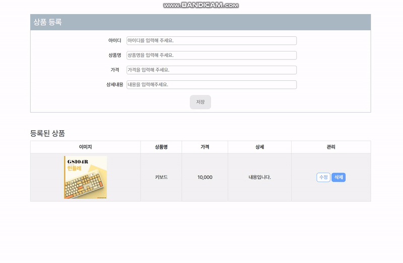
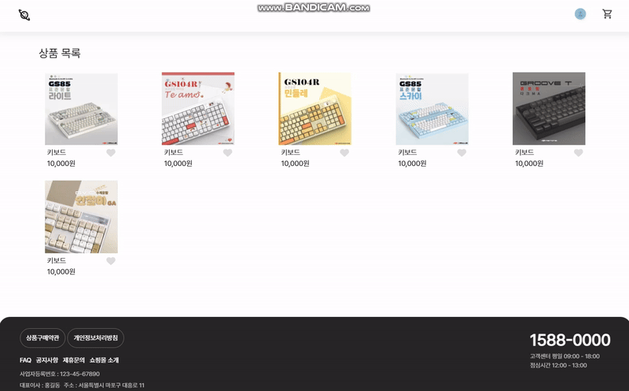

# Vanilla js로 쇼핑몰 웹 페이지 구현
상품을 등록하고 장바구니에 담을 수 있는 프론트엔드 기반 쇼핑몰 웹사이트입니다.

Vanilla js로 제작하였으며 상품 조회, 상품 등록, 상품 상세, 장바구니 페이지로 구성되어 있습니다.

## 🔧 Language

## ⭐ Main Feature
### 1. 상품 등록

- 쇼핑몰 관리자가 상품을 등록하는 페이지 입니다.

- 상품 정보를 입력하면 해당 데이터가 로컬 스토리지에 저장됩니다.

- 아이디는 숫자만 입력 가능하며 중복 여부를 체크합니다.

### 2. 상품 조회

- 등록한 상품을 조회할 수 있는 상품 조회 페이지 입니다. 상품을 클릭하면 상세페이지로 이동합니다.

- 상품의 🤍버튼을 클릭하면 ❤️로 변경되며 변경 내역이 로컬스토리지에 저장됩니다.

### 3. 상품 상세 페이지

- 상품의 상세내용을 확인할 수 있는 페이지 입니다.

- 상품을 장바구니에 담으면 우측 상단 헤더에 담긴 상품의 개수가 표시됩니다.

### 4. 장바구니

- 장바구니에 담긴 상품 목록을 화면에 표시합니다.

- 상품의 수량과 가격에 따라 총 결제 금액을 계산합니다.
