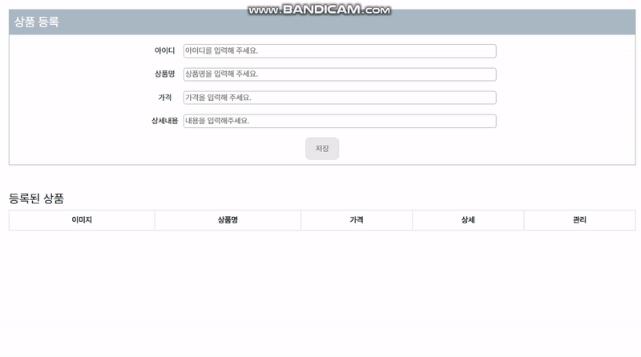
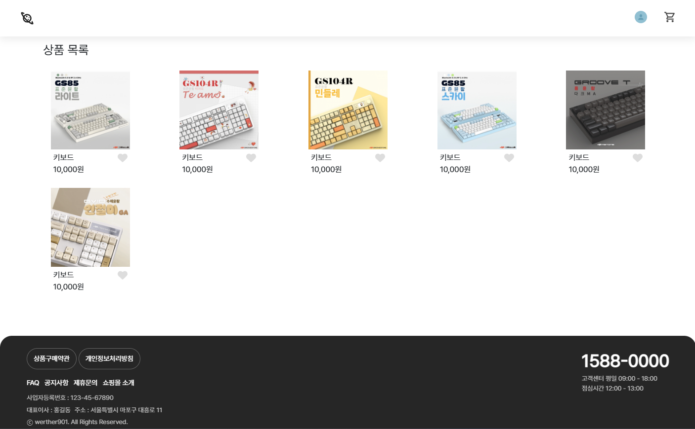
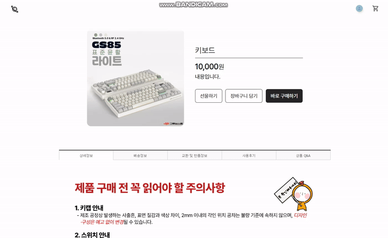
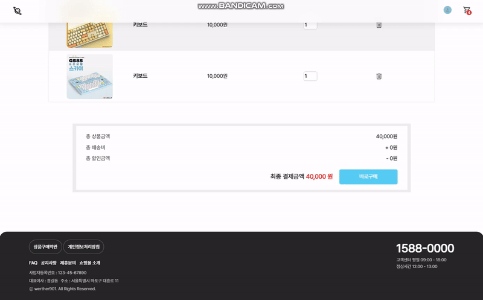

# ShoppingMall Page
쇼핑몰 사이트 만들기

(↑프로젝트를 대표하는 대표 이미지)

## 🔧 Language

## 📖 Description
상품을 등록하고 장바구니에 담을 수 있는 프론트엔드 기반 쇼핑몰 웹사이트입니다.

vanilla js로 제작하였으며 상품 조회, 상품 등록, 상품 상세, 장바구니 페이지로 구성되어 있습니다.

## ⭐ Main Feature
### 1. 상품 등록

- 쇼핑몰 사업자가 상품 정보를 입력하면 해당 데이터가 로컬 스토리지에 저장됩니다.
- 일반 쇼핑몰 이용자의 접근을 제한하기 위해 URL로만 접속 가능합니다.
- 아이디는 숫자만 입력 가능하며 중복 여부를 체크합니다.

### 2. 상품 조회

- 등록한 상품을 조회할 수 있는 메인페이지 입니다. 상품을 클릭하면 상세페이지로 이동합니다.
- 상품의 🤍버튼을 클릭하면 ❤️로 변경되며 해당 상품의 ❤️는 로컬스토리지에 저장되어 페이지를 새로고침해도 ❤️가 유지됩니다.

### 3. 상품 상세 페이지

- 상품의 상세내용을 확인할 수 있는 페이지 입니다.
- 상품을 장바구니에 담으면 우측 상단 헤더에 담긴 상품의 개수가 표시됩니다.

### 4. 장바구니

- 상세 페이지에서 담은 상품 목록이 장바구니 페이지에 표시됩니다.
- 상품의 수량과 가격에 따라 총 결제 금액을 표시합니다.

## 💻 Getting Started
추가내용

## 🔨 Server Architecture
추가내용

## ⚒ CI/CD
- 추가내용

## 👨‍💻 추가내용